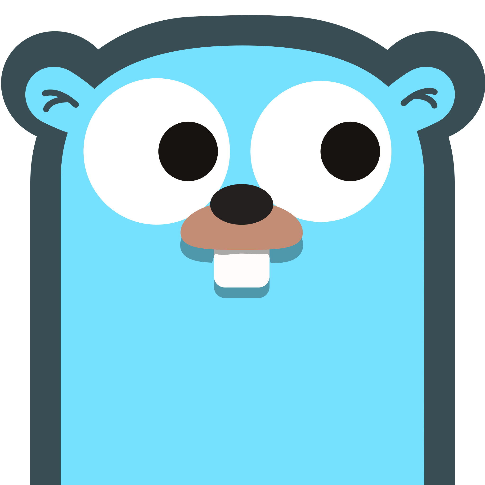
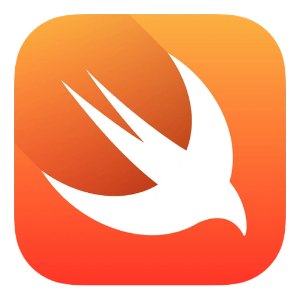

 

---

<h1 align="center">Xmorinori</h1>

  "KAWAII PEOPLE" 
  <code>Member of <a href="https://retas.org" target="_blank">retas.org</a> & <a href="https://cdef.id" target="_blank">cdef.id</a></code>
   
   PLEASE SUPPORT OUR COMMUNITY*

---

### About Me

- Indie developer, struggling more cuz i just islamic boarding school student
- Takanashi Hoshino (cuz my waifu) & Dark UI Enthusiast
- Living between lines of terminal and virtual illusions  

---

### 📬 Contact & Socials

<table>
  <tr>
    <td align="center">
      <a href="mailto:xiao.byte@proton.me">
         Email
      </a>
    </td>
    <td align="center">
      <a href="https://lnk.ink/MyDiscord">
         Discord
      </a>
    </td>
    <td align="center">
      <a href="https://lnk.ink/MyInstagram">
         Instagram
      </a>
    </td>
    <td align="center">
      <a href="https://lnk.ink/MyThreads">
         Threads
      </a>
    </td>
  </tr>
</table>

---

### Tools & Languages (I like) 

---

## Used Language
> Yo, here are my used language (most used is from left)

<table>
  <tr>
    <td align="center" width="120">
        
        Rust
    </td>
    <td align="center" width="92">
        
        Typescript
    </td>
    <td align="center" width="92">
        
        Javascript
    </td>
    <td align="center" width="92">
        
        PHP
    </td>
  </tr>
    <tr>
    <td align="center" width="92">
        
        Kotlin
    </td>
    <td align="center" width="92">
        
        C++
    </td>
    <td align="center" width="92">
        
        Go-Lang
    </td>
    <td align="center" width="92">
        
        Dart
    </td>
  </tr>
    <tr>
        <td align="center" width="92">
        
        Swift
        </td>
    </tr>
</table>

## Favourite Framework
> I don't picky about framework.

### Fun Zone

> "I'm no hero, but I still want to protect this journey of code."  
> _Even in mistakes, I still seek the truth... in code._

  

---

### Published Library

my library which used by people world wide

- [Mini Config](https://crates.io/crates/mini-config)
- [AES 256 GCM](https://crates.io/crates/aes-256-gcm) _(popular)_
- [Cerberus_V1](https://github.com/XENXIAOKAWAII/Cerberus_V1)
- [nextjs_clean_arch](https://github.com/XENXIAOKAWAII/nextjs_clean_arch)
_(UCOK)_
- [yt_downloader_py](https://github.com/XENXIAOKAWAII/yt_downloader_py)
_(popular)_
- [php_view_source_protection_devs](https://github.com/XENXIAOKAWAII/php_view_source_protection_devs)

### GitHub Stats

  <!-- Stats dan Top Languages -->
  
  

  <!-- Activity Graph dengan tema cyberpunk -->
  

## Certification
> my certification, from ISC2, IBM, OPSWAT and BinBaz. JOKES

<table>
  <tr>
    <td align="center" width="120">
      
    </td>
    <td align="center" width="120">
      
    </td>
    <td align="center" width="120">
      
    </td>
    <td align="center" width="120">
      
    </td>
  </tr>
    <tr>
    <td align="center" width="120">
      
    </td>
  </tr>
</table>
